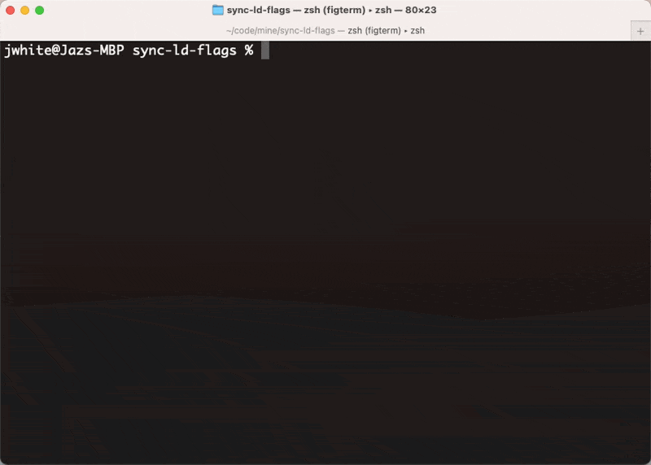

> This script is not officially supported by LaunchDarkly.
>
> To sync individual flags, use the in-application [compare and copy](https://docs.launchdarkly.com/home/code/flag-compare-copy#comparing-and-copying-flag-settings-between-two-environments) functionality instead.

# LaunchDarkly Environment Synchronizer

This Node script simplifies the task of synchronizing flag rollout rules between two different environments. It assumes that both environments are in the same project and account, and takes as input the API keys for the two environments you're syncing.

The following properties of each flag are synchronized:

* Whether the flag is toggled **On**, enabling targeting rules, or **Off**
* [Prerequisites](https://docs.launchdarkly.com/home/flags/prerequisites)
* [Individual user targeting rules](https://docs.launchdarkly.com/home/flags/individual-targeting)
* [Attribute targeting rules](https://docs.launchdarkly.com/home/flags/targeting-rules)
  * To omit clauses that reference segments, which are not shared between environments, use the `--omit-segments` flag
* [Default rule](https://docs.launchdarkly.com/home/flags/variations#changing-default-flag-values)
* Whether or not the flag is [archived](https://docs.launchdarkly.com/home/code/flag-archive)

## Quick setup

1. Install with `npm`

   ```
   npm install
   ```

2. Run the script, passing in the project key, source and destination environments, and API token:

   ```
   ./sync-ld-flags --api-token API_TOKEN \
     --project-key PROJECT_KEY \
     --source-env SOURCE_ENVIRONMENT_KEY \
     --destination-env DEST_ENVIRONMENT_KEY
   ```

   You can find your environment keys in [**Account settings**](https://app.launchdarkly.com/settings) within the LaunchDarkly application. Click the **Projects** tab and select your project, then review the list of environments and keys for that project.

   You can create an API access token from the [**Account settings**](https://app.launchdarkly.com/settings) page, on the **Authorization** tab.

   Optionally pass a host override:

   ```
   ./sync-ld-flags --api-token API_TOKEN \
     -H https://your-launchdarkly-deploy.com
     -p PROJECT_KEY \
     -s SOURCE_ENVIRONMENT_KEY \
     -d DEST_ENVIRONMENT_KEY
   ```

   Use `-D` to enable HTTP debugging if needed.

## All options

Usage:

```
./sync-ld-flags [options]
```

Options:

```
  -p, --project-key <key>      Project key
  -s, --source-env <key>       Source environment key
  -d, --destination-env <key>  Destination environment key
  -t, --api-token <token>      LaunchDarkly personal access token with
                               write-level access
  -f, --flag <flag>            Sync only the flag with the specified flag key
  -T, --tag <tags...>          Sync flags with the given tag(s). Only flags
                               with all tags will sync.
  -o, --omit-segments          Omit segments when syncing (default: false)
  -H, --host <host>            Hostname override (default:
                               "https://app.launchdarkly.com")
  -v, --verbose                Enable verbose logging (default: false)
  --dry-run                    Preview changes (default: false)
  -D, --debug                  Enable HTTP debugging (default: false)
  -h, --help                   Display help for command
```

## Other

This project supports [Fig](https://fig.io/) autocomplete!

Add `--api-token` and (optionally) `--host` at the beginning of your commands and Fig provides suggestions for your project and environment keys.

Want to set these configuration variables more easily?



You can autocomplete keys and servers by using a config file. Add the following configuration to `~/.config/ldc.json`:

```json
{
    "<NAME>": {
        "apitoken": "<your api token>",
        "server": "<[OPTIONAL] default is https://app.launchdarkly.com>"
    }
}
```

**Example**:

```json
{
    "staging": {
        "apitoken": "api-foobarfoobarfoobarfoobar",
        "server": "https://your-launchdarkly-deploy.com"
    }
}
```
